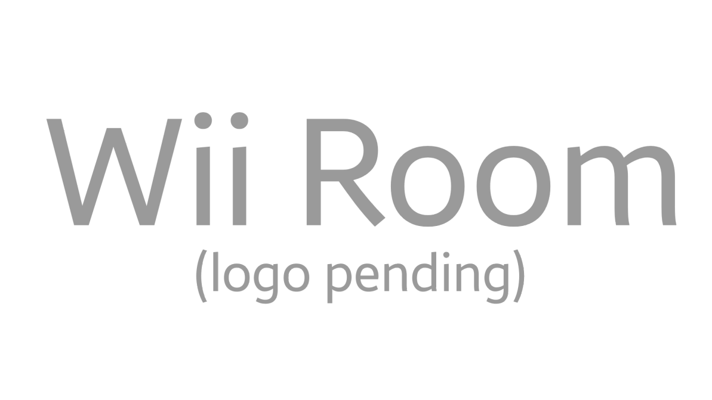

# Welcome to WiiLink24!

This is WiiLink24's official site!

## Services
### Wii no Ma (also known as Wii Room)

Wii no Ma was a Japanese exclusive service by Nintendo and Dentsu. You could buy merch with your Mii's face on it, and you could even buy food! The service also allowed you to view exclusive rooms for sponsers. There was also a live TV service. The service ended in 2013. WiiLink24 is working on reviving it!
**Current status: Close. No ETA yet**
